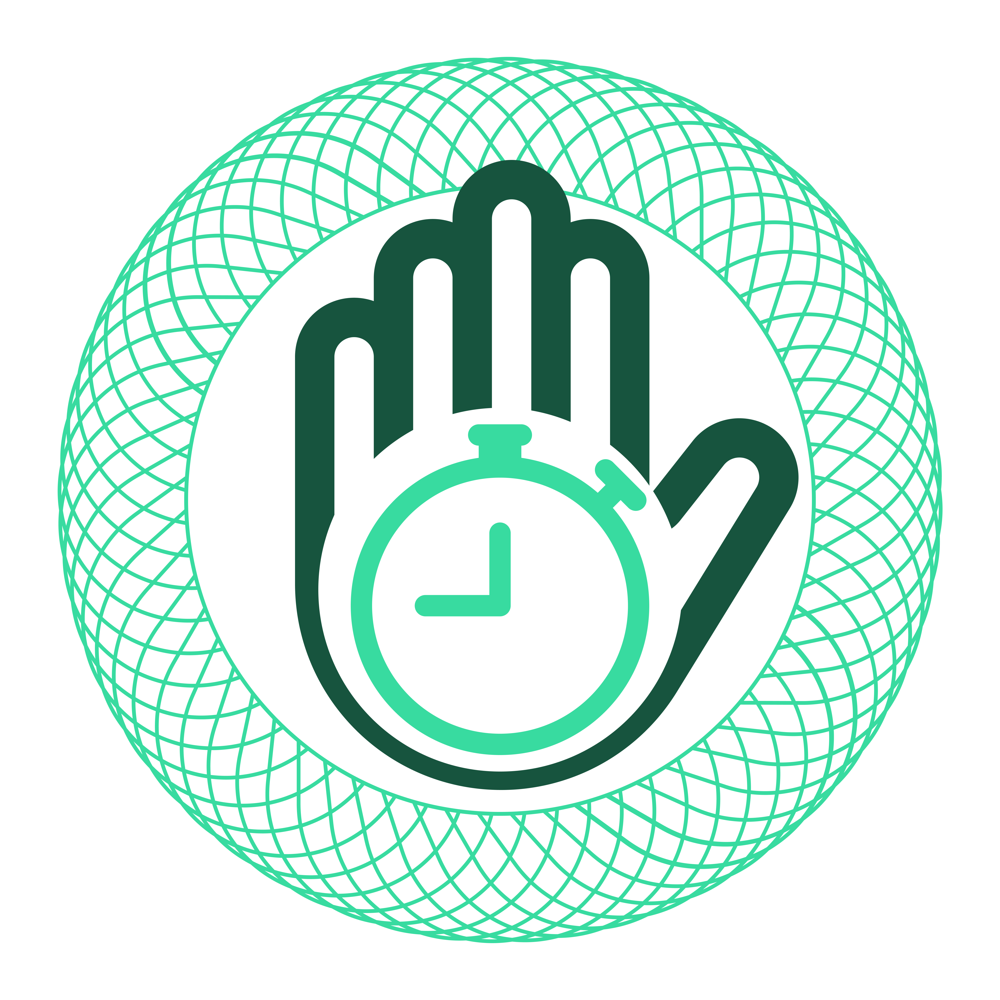

# stop-w



A Stopwatch Desktop Application made with HTML, CSS, JavaScript and Tauri.

Built with 🤍 For You!

## Features

- Lap button
- Laps Display
- Centisecond Display

## Screenshots


## Made using

- [HTML](https://www.w3schools.com/html/)
- [CSS](https://www.w3schools.com/css/default.asp)
- [JavaScript](https://www.w3schools.com/js/default.asp)
- [Tauri](https://tauri.studio/)

### Tools

- [VS Code](https://code.visualstudio.com/)

### Some Websites Used

- [Favicon.io](https://favicon.io/)

## Concepts Used

- JavaScript Constants
- JavaScript Strings
- Tauri Desktop Application

## Run Locally

Clone the project

```bash
  git clone https://github.com/kushagra-aa/stop-w.git
```

Go to the project directory

```bash
  cd stop-w
```

Install dependencies

```bash
  npm i
```

Development Build

Runs the app in the development mode.

```bash
  npm run tauri dev
```

The App Window will automatically appear
